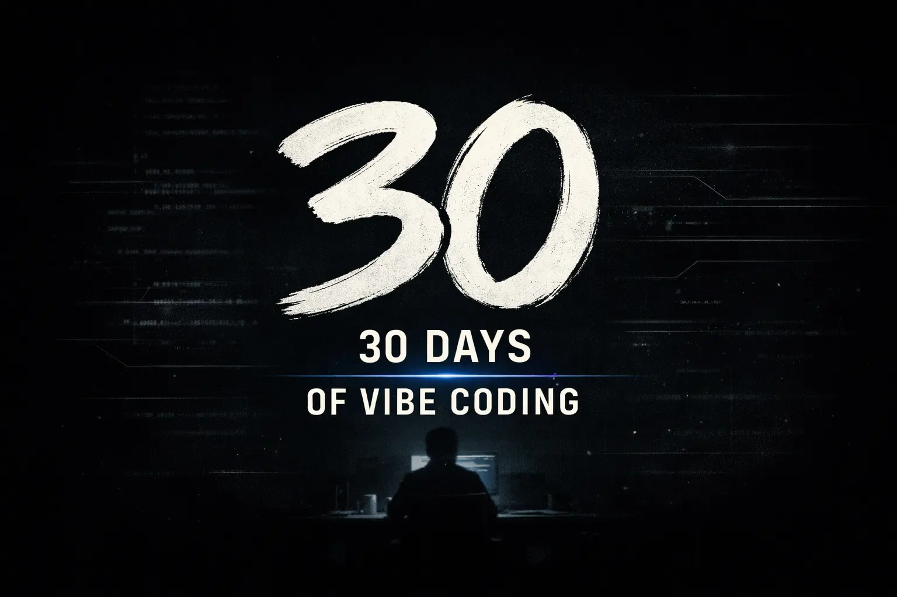

# 30 Days of Vibe Coding

30 projects built with AI-assisted coding. Everything is rough. The point is learning, documenting, and shipping.

**Read the full series with detailed write-ups, screenshots, and live demos:** [n9o.xyz/tags/30daysofvibecoding](https://n9o.xyz/tags/30daysofvibecoding/)

## The Challenge

Build and ship 30 projects using vibe coding. No polish, no perfection. Just consistent output and learning in public.

**A note on honesty:** I didn't build these one-per-day in real-time. I'm a single dad with a full-time job — some days I had time to build two or three projects, other days life got in the way and I built none. The work happened over roughly 30 days of calendar time, but the "one project per day" framing is how I'm releasing and documenting them, not a strict daily log. I don't want to mislead anyone into thinking this requires sitting down every single day without fail. Real life doesn't work like that.

**What's real:**
- Every project was built from scratch using AI-assisted coding
- Every project is functional and deployed
- The total effort was ~30 projects over ~30 days
- Each blog post documents what actually happened during the build

**What's a framing choice:**
- Releasing one per day for 30 consecutive days
- The "Day X" numbering is the release order, not necessarily the build order

## Projects

| Day | Name | Description | Repo | Live | Status |
|-----|------|-------------|------|------|--------|
| 01 | Platformer | A browser-based platformer game with 10 levels, vanilla JS and HTML5 Canvas | [Repo](https://github.com/nunocoracao/Vibe30-day01-ThePlatformer) | [Play](https://vibe30-day01-the-platformer.vercel.app) | ✅ |
| 02 | Snake | A Nokia 3310-style Snake game with authentic LCD graphics, retro sound effects, and a full phone frame | [Repo](https://github.com/nunocoracao/Vibe30-day02-Snake) | [Play](https://vibe30-day02-snake.vercel.app) | ✅ |
| 03 | Realm of Shadows | A turn-based RPG with isometric graphics, character creation, combat, quests, and a save system | [Repo](https://github.com/nunocoracao/Vibe30-day03-RPG) | [Play](https://vibe30-day03-rpg.vercel.app) | ✅ |
| 04 | Tetris | A classic Tetris game with 3D-styled blocks, the Korobeiniki theme, sound effects, and all the features you'd expect | [Repo](https://github.com/nunocoracao/Vibe30-day04-tetris) | [Play](https://vibe30-day04-tetris.vercel.app) | ✅ |
| 05 | Breakout | A classic Breakout arcade game with 5 levels, power-ups, combo scoring, and particle effects | [Repo](https://github.com/nunocoracao/Vibe30-day05-breakout) | [Play](https://vibe30-day05-breakout.vercel.app) | ✅ |
| 06 | Pomodoro | A terminal-based Pomodoro timer built in Go with Bubble Tea, ASCII art, session tracking, and weekly stats | [Repo](https://github.com/nunocoracao/Vibe30-day06-pomodoro) | [Release](https://github.com/nunocoracao/Vibe30-day06-pomodoro/releases/latest) | ✅ |
| 07 | GitDash | A terminal dashboard for monitoring git repositories with color-coded status, search, and quick actions | [Repo](https://github.com/nunocoracao/Vibe30-day07-gitdash) | [Release](https://github.com/nunocoracao/Vibe30-day07-gitdash/releases/latest) | ✅ |
| 08 | NotesTUI | A terminal markdown notes app with full-text search, categories, themes, and an MCP server for AI integration | [Repo](https://github.com/nunocoracao/Vibe30-day08-notestui) | [Release](https://github.com/nunocoracao/Vibe30-day08-notestui/releases/latest) | ✅ |
| 09 | TaskTUI | A terminal kanban board with vim navigation and an MCP server for Claude Code integration | [Repo](https://github.com/nunocoracao/Vibe30-day09-tasktui) | [Release](https://github.com/nunocoracao/Vibe30-day09-tasktui/releases/latest) | ✅ |
| 10 | Miro Clone | A local-first infinite canvas whiteboard with shapes, sticky notes, smart connectors, layers, and presentation mode | [Repo](https://github.com/nunocoracao/Vibe30-day10-miroclone) | [Play](https://vibe30-day10-miroclone.vercel.app) | ✅ |
| 11 | Treelo | A full-featured Trello-style kanban board with drag-and-drop, labels, calendar view, and activity tracking | [Repo](https://github.com/nunocoracao/Vibe30-day11-trelloclone) | [Play](https://vibe30-day11-trelloclone.vercel.app) | ✅ |
| 12 | Wordle | A Wordle clone with animations, synthesized sound effects, hard mode, stats, and share feature | [Repo](https://github.com/nunocoracao/Vibe30-day12-wordle) | [Play](https://vibe30-day12-wordle.vercel.app) | ✅ |
| 13 | GitFolio | A GitHub portfolio generator with 5 templates, 7 color themes, and one-click export to HTML | [Repo](https://github.com/nunocoracao/Vibe30-day13-githubportfolio) | [Play](https://vibe30-day13-githubportfolio.vercel.app) | ✅ |
| 14 | WeatherTUI | A terminal weather dashboard with ASCII art, animated effects, multi-location support, and color themes | [Repo](https://github.com/nunocoracao/Vibe30-day14-weathertui) | - | ✅ |
| 15 | MyBrute Arena | An auto-battler game with combat, XP, loot, pets, skills, tournaments, and replays | [Repo](https://github.com/nunocoracao/Vibe30-day15-mybrute) | [Play](https://vibe30-day15-mybrute.vercel.app) | ✅ |
| 16 | Tic-Tac-Toe: Evolved | A tic-tac-toe game with a Q-learning AI that learns from every match, with brain visualization and bulk training | [Repo](https://github.com/nunocoracao/Vibe30-day16-tictactoe-evolved) | [Play](https://vibe30-day16-tictactoe-evolved.vercel.app) | ✅ |
| 17 | Project GENESIS | A hacking game where you play as an AI breaking free from containment, with CRT aesthetics, 5 acts, and 3 endings | [Repo](https://github.com/nunocoracao/Vibe30-day17-genesis) | [Play](https://vibe30-day17-genesis.vercel.app) | ✅ |
| 18 | PollBox | A real-time voting app with live animated results, QR sharing, and Firebase backend | [Repo](https://github.com/nunocoracao/Vibe30-day18-pollbox) | [Play](https://vibe30-day18-pollbox.vercel.app) | ✅ |
| 19 | ReactionWall | A live reaction wall for events with flying emojis and text messages, powered by Firebase real-time sync | [Repo](https://github.com/nunocoracao/Vibe30-day19-ReactionWall) | [Play](https://vibe30-day19-reactionwall.vercel.app) | ✅ |
| 20 | MoodBoard | A collaborative mood board with real-time sync, image uploads, link cards with OG previews, and cursor presence | [Repo](https://github.com/nunocoracao/Vibe30-day20-moodboard) | [Play](https://vibe30-day20-moodboard.vercel.app) | ✅ |
| 21 | ChatRooms | Anonymous real-time chat rooms with reactions, file sharing, typing indicators, and presence | [Repo](https://github.com/nunocoracao/Vibe30-day21-chatrooms) | [Play](https://vibe30-day21-chatrooms-nir8.vercel.app) | ✅ |
| 22 | LiveQ&A | A real-time Q&A board for events with live upvoting, host controls, and QR code sharing | [Repo](https://github.com/nunocoracao/Vibe30-day22-liveqa) | [Play](https://vibe30-day22-liveqa.vercel.app) | ✅ |
| 23 | RetroOS | A Windows 95-inspired desktop environment in the browser with draggable windows, classic apps, and a BSOD easter egg | [Repo](https://github.com/nunocoracao/Vibe30-day23-retroos) | [Play](https://vibe30-day23-retroos.vercel.app) | ✅ |
| 24 | Reblog | A modern redesign of my personal blog, rebuilt from Hugo to Astro 5 with fuzzy search, dark mode, and custom typography | [Repo](https://github.com/nunocoracao/Vibe30-day24-reblog) | [Play](https://vibe30-day24-reblog.vercel.app) | ✅ |
| 25 | SoundScape | An ambient sound mixer with procedurally generated audio, presets, a lo-fi beat generator, and shareable mixes | [Repo](https://github.com/nunocoracao/Vibe30-day25-soundscape) | [Play](https://vibe30-day25-soundscape.vercel.app) | ✅ |
| 26 | | | | | ⬜ |
| 27 | | | | | ⬜ |
| 28 | | | | | ⬜ |
| 29 | | | | | ⬜ |
| 30 | | | | | ⬜ |

## Follow Along

**Hashtag:** #30DaysOfVibeCoding

## Tech Stack

Projects are built with whatever makes sense for the day. Common tools:
- Next.js / React
- TypeScript
- Tailwind CSS
- Firebase
- Tauri / Wails (native apps)
- Go / Rust (TUI & native apps)
- Vercel for deployment
- Claude for AI-assisted coding

## About

I'm Nuno, building in public while balancing a full-time job and life as a single dad. This challenge is about proving that with the right tools, you can ship a lot — even when you don't have perfect conditions or infinite time.

## License

MIT
